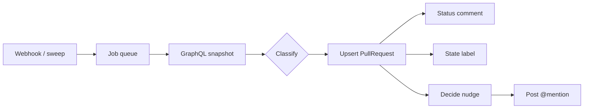

# Architecture

Baton is a Next.js application backed by PostgreSQL, a background worker, and a
GitHub App. This document explains the moving parts and why they are shaped the
way they are.

## Overview

```
                    ┌────────────────────────────────────────┐
   GitHub ──hooks─▶ │ /api/webhooks  (verify + idempotency)  │
                    └───────────────┬────────────────────────┘
                                    │ enqueue
                                    ▼
                    ┌────────────────────────────────────────┐
                    │ Job table (pending/processing/done)     │
                    └───────────────┬────────────────────────┘
                                    │ claim
                                    ▼
   GitHub  ◀──REST── ┌────────────────────────────────────────┐
   (GraphQL)  ──────▶│ engine/runner: fetch → classify → write │
                    └───────────────┬────────────────────────┘
                                    │
              ┌─────────────────────┼─────────────────────┐
              ▼                     ▼                     ▼
      status comment          state label            nudge comment
                                    │
                                    ▼
                       ┌──────────────────────────┐
                       │ PostgreSQL (SQLite local) │◀── dashboard (Next.js RSC)
                       └──────────────────────────┘
                                    ▲
                        worker (npm run worker) / cron sweep
```

## Layers

| Path | Responsibility |
| --- | --- |
| `src/app/api/webhooks` | Raw-body webhook intake: HMAC verify, rate limit, dedupe, dispatch. |
| `src/lib/webhooks/dispatcher.ts` | Pure mapping of a GitHub event to queued work. |
| `src/lib/engine/jobs.ts` | Job payload definitions + dedupe-aware enqueue. |
| `src/lib/engine/job-runner.ts` | Atomic job claim, retry/backoff, watchdog. |
| `src/lib/engine/runner.ts` | The product loop for one PR: snapshot → classify → persist → act. |
| `src/lib/engine/classification.ts` | Pure, deterministic state machine. |
| `src/lib/engine/nudges.ts` | Threshold + nudge decision logic and message copy. |
| `src/lib/engine/message.ts` | The live status-comment body. |
| `src/lib/github/*` | Octokit app auth, GraphQL snapshot query, REST actions, install lifecycle. |
| `src/lib/auth/*` | GitHub OAuth, cookie sessions, CSRF state. |
| `src/lib/queries/dashboard.ts` | Read-side queries scoped to the signed-in user. |
| `src/worker/*` | Queue worker and one-shot cron sweep entrypoints. |

## Data model

Canonical schema: `prisma/schema.prisma` (PostgreSQL). A generated SQLite mirror
(`prisma/schema.sqlite.prisma`) keeps local development Postgres-free while
preserving identical client shapes. No enums or provider-specific column types
are used, so both providers stay in sync.

- **User** — GitHub identity; owns sessions and installations.
- **Session** — server-side session with a SHA-256 `tokenHash`; the raw token
  lives only in an httpOnly cookie.
- **AppInstallation** — a GitHub App installation, optionally linked to a User.
- **Repo** — a repository made visible by an installation, with an `enabled` flag.
- **RepoSetting** — per-repo feature toggles and nudge thresholds (hours).
- **PullRequest** — the materialized snapshot + classification for a PR, including
  `stateEnteredAt` (how long it has been stuck), `nudgeBucketsJson` (which nudges
  fired), and `statusCommentId` (to update the status card in place).
- **WebhookEvent** — `@@unique([deliveryId, eventType])` for durable idempotency.
- **Job** — the work queue, with `attempts`, `maxAttempts`, `nextAttemptAt`.
- **Action** — an append-only ledger of what Baton did to GitHub.
- **AuditLog** — human/account actions (sign-in etc.).

## The state machine

`classifyPullRequest(input, prevState)` is pure and returns
`{ state, action, reasons, whoseTurn, nudgable, hasFirstResponse }`.

Evaluation order (first match wins):

1. `MERGED` → **merged**; `CLOSED` → **closed**.
2. `isDraft` → **draft**.
3. `mergeable === CONFLICTING` → **conflicts** (author).
4. Any check failing/cancelled/timed-out → **ci_failing** (author).
   *AI review bots are filtered out upstream in the runner.*
5. Approved but checks still pending → **blocked_on_checks** (not nudgable).
6. A pending change request (and no overriding approval) → **changes_required**
   (author), or **awaiting_review_after_fix** (reviewers) if the author has
   pushed since the change request.
7. Approved + green + mergeable → **ready_to_merge** (author/maintainer).
8. Otherwise → **awaiting_review** (reviewers).

`prevState` is recorded so transitions are observable; `stateEnteredAt` is only
reset when the state actually changes, which makes stall durations accurate.

## Processing pipeline

1. A webhook arrives. The route reads the **raw body**, verifies
   `x-hub-signature-256` (constant-time HMAC-SHA256), applies IP rate limiting,
   and inserts a `WebhookEvent` row. A duplicate `(deliveryId, eventType)` is a
   harmless no-op.
2. `dispatchEvent` maps the event to jobs: PR events refresh the PR; check events
   refresh the PRs they belong to; `installation.created` enqueues registration.
3. A worker atomically claims a job (`updateMany` guarded by status), processes it,
   and marks it done. Failures increment `attempts` and re-queue with exponential
   backoff until `maxAttempts`. Jobs stuck in `processing` for 5+ minutes are
   recovered by a watchdog at the top of each claim cycle.
4. `processPrRefresh` re-fetches the single PR via GraphQL, classifies it,
   upserts the `PullRequest`, then — honoring per-repo settings — upserts the
   status comment, syncs the state label, and posts a nudge if thresholds and
   bucket counts allow.
5. Every scheduled sweep (`npm run cron`, expected on a hosted cron) lists open
   PRs per enabled repo and enqueues refreshes, so Baton is self-healing even if a
   webhook is ever dropped.



## Why a queue instead of inline processing

GitHub expects webhooks to be acknowledged quickly. Doing API reads and writes
inline would couple latency to GitHub's API, risk timeouts, and lose work on
restarts. A durable `Job` table gives retries, backoff, and horizontal
scalability (multiple workers can claim concurrently), all with `SELECT`-level
locking rather than introducing another service.

## Local vs production database

- **Local dev / CI:** SQLite via the generated mirror. `npm run db:sqlite:push`.
- **Production:** PostgreSQL. `npm run db:generate` then `npm run db:deploy`.
  Regenerate the client from the canonical schema in the build step so the
  generated client targets Postgres.

Because both schemas are generated from one source of truth, there is no
query-level branching in application code.

## Deployment notes

- Set all variables in `ENVIRONMENT.md`; `DATABASE_URL` is required in production.
- Run migrations with `prisma migrate deploy` before starting the app.
- Run at least one `npm run worker` process (separate from the web process).
- Schedule `npm run cron` (or POST the same sweep) on an interval equal to
  `BATON_CRON_INTERVAL_MIN`.
- Rate limiting is in-memory; move to a shared store (e.g. Redis) when running
  more than one web instance.
